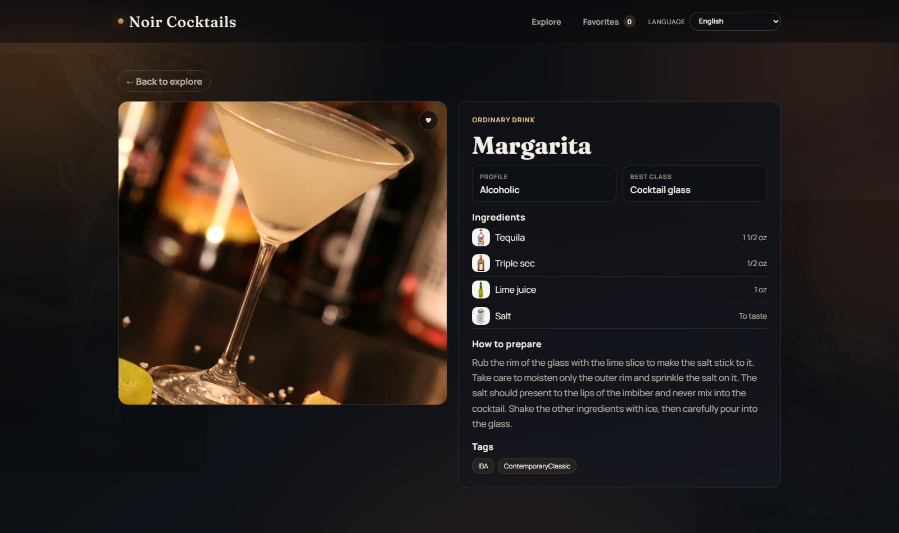

# API and Data Flow

This document explains how Noir Cocktails consumes TheCocktailDB API and transforms data for the UI.

## Visual snapshot

## 1. API base

- Base URL: `https://www.thecocktaildb.com/api/json/v1/1`

Low-level HTTP is implemented in `src/services/apiClient.ts`.

- `apiClient.get<T>(path, signal?)`
- Throws `ApiClientError` for HTTP/parsing failures.
- Supports abort via `AbortSignal`.

## 2. Endpoints used

### Categories

- Endpoint: `list.php?c=list`
- Service method: `cocktailService.listCategories()`
- Output: `CategoryItem[]`

### Search by name

- Endpoint: `search.php?s={query}`
- Service method: `cocktailService.searchByName(name)`
- Input normalization: `normalizeSearchQueryForApi()`
- Output: `DrinkSummary[]`

### Search by first letter

- Endpoint: `search.php?f={letter}`
- Service method: `cocktailService.searchByFirstLetter(letter)`
- Output: `DrinkSummary[]`

### Filter by category

- Endpoint: `filter.php?c={category}`
- Service method: `cocktailService.filterByCategory(category)`
- Output: `DrinkSummary[]`

### Drink details by id

- Endpoint: `lookup.php?i={id}`
- Service method: `cocktailService.getById(id)`
- Output: `DrinkDetails | null`

## 3. "All drinks" strategy

TheCocktailDB does not expose a direct endpoint for "all drinks" with server pagination.

Current strategy in `cocktailService.listAllDrinks()`:

1. Request `search.php?f=` for each letter `a-z` in parallel.
2. Collect fulfilled results.
3. Deduplicate by `idDrink`.
4. Cache merged list in memory (`cachedAllDrinks`).

This enables an unfiltered default home listing while avoiding repeated heavy fetches.

## 4. Mapping and normalization

`src/utils/mappers.ts` handles DTO -> domain mapping.

### Domain output

- `DrinkSummary`
  - `id`, `name`, `thumbnail`, `category`, `alcoholic`, `glass`

- `DrinkDetails`
  - summary fields plus `instructions`, `instructionsTranslations`, `tags`, `ingredients`, `videoUrl`

### Ingredient image support

Ingredient media URL is generated by `buildIngredientImageUrl()` in `src/utils/cocktailMedia.ts`.

### Video support

YouTube URLs are converted to embeddable URLs using `toYoutubeEmbedUrl()` in `src/utils/video.ts`.

## 5. Instruction translation flow

Instruction text is resolved in the details panel (`DrinkDetailsPanel.vue`) using this order:

1. If locale is `en-US`: use `instructionsTranslations.en`.
2. If locale is `es-ES` and API has `strInstructionsES`: use it.
3. Else use runtime translation fallback from English.
4. If translation fails: keep English and show source hint.

Runtime translation service:

- File: `src/services/translationService.ts`
- Endpoint: `translate.googleapis.com`
- Cache: in-memory `Map<"lang:text", translatedText>`

## 6. Home data flow

Home view has two synchronized state sources:

1. URL query state
2. Discovery composable state

Flow:

1. Parse query params -> normalized `HomeQueryState`
2. Convert to `DiscoveryRouteState`
3. Apply to `useCocktailDiscovery`
4. Fetch data only when effective state changes
5. Render current page slice client-side (`page`, `limit`)
6. Canonicalize query if malformed or redundant

## 7. Error and loading model

For each async flow:

- Keep explicit loading flags (`isLoadingDrinks`, `isLoadingCategories`, `isLoading`).
- Surface user-facing error strings through i18n keys.
- Use `LoadingState` and `EmptyState` components for predictable UX.

## 8. Abort and debounce behavior

- Discovery fetch calls cancel previous pending request using `AbortController`.
- Search input sync is debounced before query replacement.
- Debounced reactive utility is implemented in `useDebouncedRef`.

## 9. Pagination model

Pagination is client-side but URL-driven:

- `limit` options are constrained to `8 | 12 | 16 | 24`.
- `page` is clamped to valid bounds.
- If total pages shrink (filter change), page is corrected automatically.
- On page/limit change, scroll targets the results section top, not page top.

## 10. Data and API limitations to be aware of

- API responses can return `drinks: null`.
- Some localized instruction fields are missing for many drinks.
- Some metadata fields are sparse (category, glass, tags may be null).
- Translation fallback depends on external network availability.

When adding features, design with these inconsistencies in mind.
