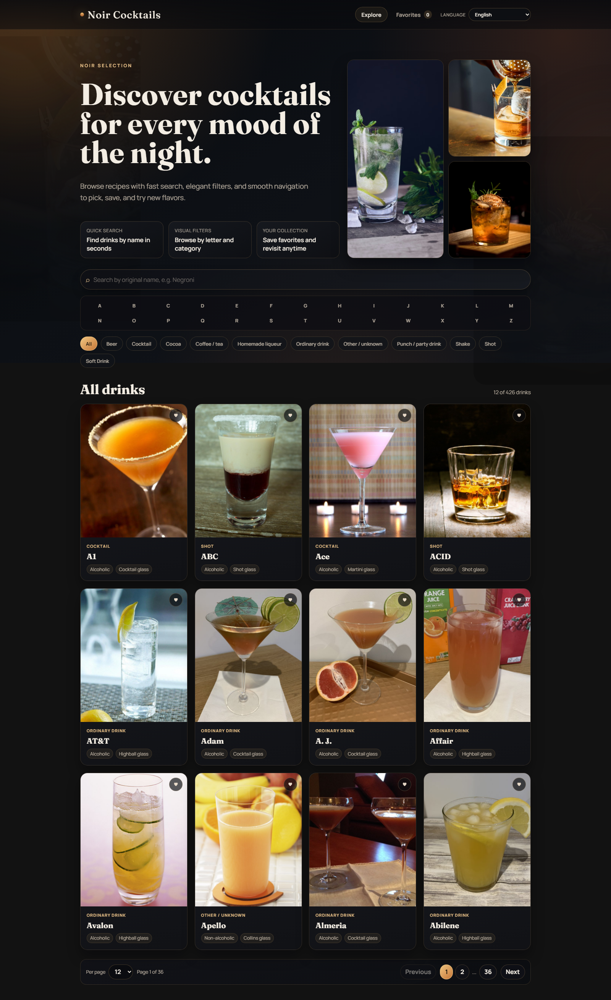

# Architecture

This document explains the architectural model used in Noir Cocktails.

## Visual snapshot

## 1. Architectural goals

- Keep UI components focused on rendering and interaction.
- Isolate API access and transport errors from view logic.
- Keep domain models stable even if API shape changes.
- Preserve predictable route-driven state in discovery flows.
- Enforce strict TypeScript usage with minimal implicit behavior.

## 2. Layered frontend model

The project follows a practical layered architecture:

1. **Views** (`src/views`)
   - Route-level pages.
   - Compose feature components and bind route state.

2. **Components** (`src/components`)
   - Reusable UI units.
   - Stateless or locally stateful presentation logic.

3. **Composables** (`src/composables`)
   - Reusable stateful behavior and orchestration.
   - Example: `useCocktailDiscovery` coordinates filter mode, loading states, and fetch flow.

4. **Services** (`src/services`)
   - External data access and transport behavior.
   - `apiClient` wraps low-level fetch.
   - `cocktailService` implements domain-oriented API calls.
   - `translationService` handles runtime instruction translation fallback.

5. **Mappers / Utils** (`src/utils`)
   - DTO to domain mapping and normalization.
   - Localization helpers for API-provided values.
   - URL and media utility functions.

6. **State Store** (`src/stores`)
   - Pinia store for cross-view client state.
   - `favorites` is persisted with LocalStorage.

7. **Types** (`src/types`)
   - API contracts (`api.ts`) and domain models (`cocktail.ts`).

## 3. Dependency direction

Use this direction as a rule:

- `views -> components/composables/stores/services/utils/types`
- `components -> composables/stores/utils/types`
- `composables -> services/utils/types`
- `services -> utils/types`
- `utils -> types` (or standalone)

Avoid reverse dependencies (for example, services importing views/components).

## 4. Route-centric state strategy

The home discovery state is route-driven and canonicalized by query params.

### Query keys

- `q` for search
- `category` for category mode
- `filter=letter` plus `letter` for explicit alphabet mode
- `page` and `limit` for pagination

### Why this matters

- Enables deep links to exact filtered state.
- Preserves context when opening a drink details page and coming back.
- Works with browser back/forward history naturally.

## 5. Discovery orchestration

`useCocktailDiscovery` is the central orchestration unit.

Responsibilities:

- Maintains discovery mode (`all`, `search`, `letter`, `category`).
- Fetches categories and drinks with loading and error states.
- Cancels stale in-flight requests with `AbortController`.
- Debounces search-driven requests.
- Applies externally provided route state (`applyExternalState`).

## 6. Data contract isolation

API DTOs are defined in `src/types/api.ts`.
Domain models are defined in `src/types/cocktail.ts`.

`src/utils/mappers.ts` converts from DTOs to internal models. This keeps UI code independent from raw API shape and allows controlled fallback behavior.

## 7. Internationalization architecture

- UI text comes from `vue-i18n` locale files (`src/i18n/locales`).
- API categorical values are localized by token mapping (`src/utils/apiLocalization.ts`).
- Instructions are locale-resolved in the details panel, using:
  1) API native language text when available,
  2) Translation service fallback,
  3) Original English as final fallback.

## 8. Styling system

- Global tokens in `src/styles/tokens.scss`.
- Global base styles in `src/styles/main.scss`.
- Scoped styles per component/view.

This provides a shared visual language while keeping component-level encapsulation.

## 9. Persistence model

- Favorites stored as serialized `DrinkSummary[]` in LocalStorage.
- Selected locale stored in LocalStorage.

Persistence helpers:

- `src/utils/storage.ts`

Storage keys:

- `noir-cocktails-favorites`
- `noir-cocktails-locale`

## 10. Suggested extension points

- Add request retry/backoff policy inside `apiClient`.
- Add analytics hooks in composables/view events.
- Introduce feature folders if the app grows significantly.
- Add unit/integration tests for composables and services.
